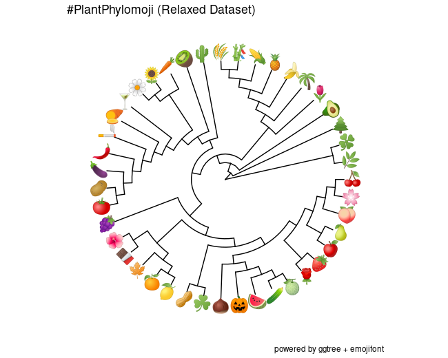
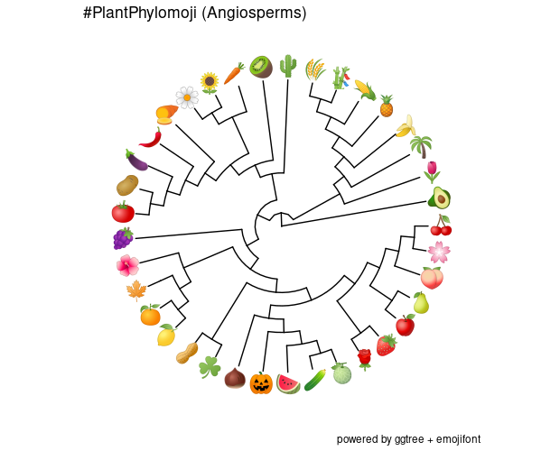
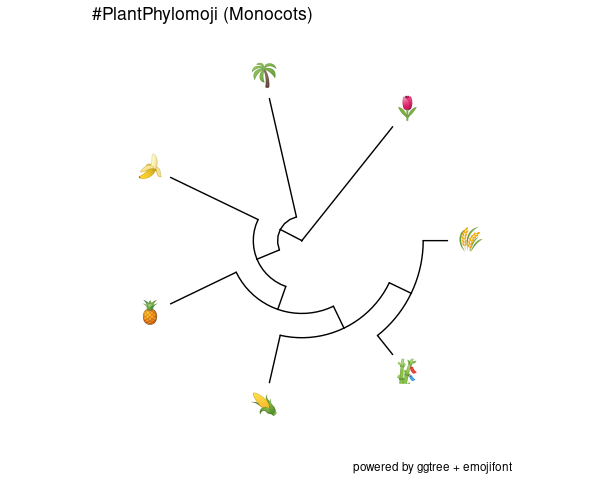
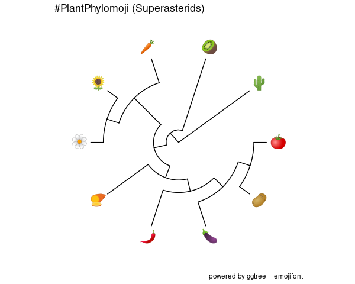
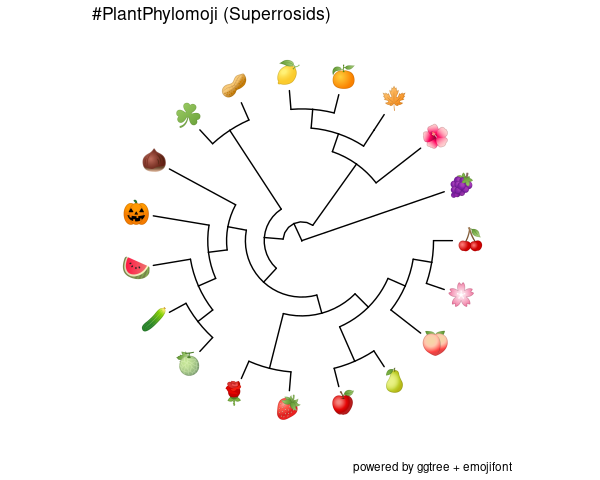
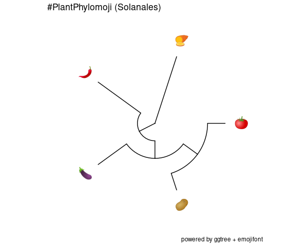

# PlantPhylomoji Datasets

The plant phylomoji dataset features the following plant species and character information: 

|Name |Emoji|Emoji_text_code |Species|Family| n |gs|
|-----------------|-------|------------------|------------------------|-----------------|----|-------|
|Apple|🍎|apple|*Malus domestica*|Rosaceae |17|0.75|
|Avocado|🥑|avocado|*Persea americana*|Lauraceae |12|0.92|
|Bamboo|🎋|tanabata_tree|*Phyllostachys sp.*|Poaceae |24|2.4|
|Banana|🍌|banana|*Musa x paradisiaca*|Musaceae |11|0.68|
|Carrot|🥕|carrot|*Daucus carota*|Apiaceae |9|0.47|
|Cherry|🍒|cherries|*Prunus avium*|Rosaceae |8|0.43|
|Chestnut|🌰|chestnut|*Castanea dentata*|Fagaceae |12|0.98|
|Chili Pepper|🌶️|hot_pepper|*Capsicum annuum*|Solanaceae |12|3.16|
|Chocolate|🍫|chocolate_bar|*Theobroma cacao*|Malvaceae |10|0.4|
|Clover|☘️|shamrock|*Trifolium sp.*|Fabaceae |14|0.73|
|Corn|🌽|corn|*Zea mays*|Poaceae |10|2.7|
|Cucumber|🥒|cucumber|*Cucumis sativus*|Cucurbitaceae |7|0.9|
|Daisy|🌼|blossom|*Bellis perennis*|Asteraceae |9|1.58|
|Eggplant|🍆|eggplant|*Solanum melongena*|Solanaceae |12|1|
|Fern|🌿|herb|*Mickelia sp.*|Dryopteridaceae |NA |NA|
|Grapes|🍇|grapes|*Vitis vinifera*|Vitaceae |19|0.4|
|Hibiscus|🌺|hibiscus|*Hibiscus rosa-sinensis*|Malvaceae |40|2.37|
|Japanese Cherry|🌸|cherry_blossom|*Prunus x yedoensis*|Rosaceae |16|0.55|
|Kiwi|🥝|kiwi_fruit|*Actinidia deliciosa*|Actinidiaceae |87|2.2|
|Lemon|🍋|lemon|*Citrus × limon*|Rutaceae |9|0.4|
|Maple|🍁|maple_leaf|*Acer sp.*|Sapindaceae |13|0.71|
|Melon|🍈|melon|*Cucumis melo*|Cucurbitaceae |12|1|
|Olive|🍸️|cocktail|*Olea europaea*|Oleaceae |23|1.95|
|Palm|🌴|palm_tree|*Cocos nucifera*|Arecaceae |16|2.8|
|Peach|🍑|peach|*Prunus persica*|Rosaceae |8|0.3|
|Peanuts|🥜|peanuts|*Arachis hypogaea*|Fabaceae |20|2.87|
|Pear|🍐|pear|*Pyrus malus*|Rosaceae |17|0.62|
|Pine|🌲|evergreen_tree|*Pinus sp.*|Pinaceae |NA |NA| 
|Pineapple|🍍|pineapple|*Ananas comosus*|Bromeliaceae |25|0.55|
|Potato|🥔|potato|*Solanum tuberosum*|Solanaceae |24|0.89|
|Pumpkin|🎃|jack_o_lantern|*Cucurbita maxima*|Cucurbitaceae |20|0.46|
|Rice|🌾|ear_of_rice|*Oryza sativa*|Poaceae |12|0.5|
|Rose|🌹|rose|*Rosa sp*|Rosaceae |7|0.76|
|Saguaro|🌵|cactus|*Carnegiea gigantea*|Cactaceae |11|1.44|
|Strawberry|🍓|strawberry|*Fragaria vesca*|Rosaceae |7|0.25|
|Sunflower|🌻|sunflower|*Helianthus annuus*|Asteraceae |17|3.67|
|Sweet potato|🍠|sweet_potato|*Ipomoea batatas*|Convolvulaceae |45|2.3|
|Tangerine|🍊|tangerine|*Citrus reticulata*|Rutaceae |9|0.47|
|Tobacco|🚬|smoking|*Nicotiana tabacum*|Solanaceae |24|5.18|
|Tomato|🍅|tomato|*Solanum lycopersicum*|Solanaceae |12|1.06|
|Tulip|🌷|tulip|*Tulipa sp.*|Liliaceae |12|15.13|
|Water Clover|🍀|four_leaf_clover|*Marsilea sp.*|Marsileaceae |NA |NA| 
|Watermelon|🍉|watermelon|*Citrullus lanatus*|Cucurbitaceae |11|0.5|

 Haploid chromosome number (n) and Genome Size (gs) from Escudero & Wendel 2020.

Download dataset as csv: [plantphylomoji.csv](https://raw.githubusercontent.com/ghuertaramos/PlantPhylomoji/master/data/plantphylomoji.csv) 

# Complete Strict tree

This is the original tree. The parenthetical phylogeny includes Mangoes and Lettuce.

( 🌲,( 🥑,(( 🌷, ( 🌴, ( 🍌, ( 🍍, ( 🌽, ( 🎋, 🌾 )))))),(( 🍇, ((( 🥜, ☘️), ((( 🌹, 🍓 ), (( 🍎, 🍐 ), ( 🍑, (🌸, 🍒) ))), ( 🌰, ( 🎃, ( 🍉, ( 🥒, 🍈)))))), (( 🌺, 🥦 ), (( 🍊, 🍋 ), ( 🍁, 🥭))))),( 🌵, ( 🥝, (( 🍠, ( 🌶️, (🍆, ( 🥔, 🍅)))), ( 🥕,( 🥬, ( 🌻, 🌼)))))))))

 

# Complete Relaxed tree

This tree includes emojis of plant byproducts, and other emojis with an unclear ID. 
🍀= *Marsilea*,  🍫 = *Theobroma* and  🚬 = *Nicotiana*

(( 🌿, 🍀),( 🌲,( 🥑,(( 🌷, ( 🌴, ( 🍌, ( 🍍, ( 🌽, ( 🎋, 🌾 )))))),(( 🍇, ((( 🥜, ☘️), ((( 🌹, 🍓 ), (( 🍎, 🍐 ), ( 🍑, ( 🌸, 🍒) ))), ( 🌰, ( 🎃, ( 🍉, ( 🥒, 🍈)))))), ((🥦, ( 🌺, 🍫)), (( 🍊, 🍋 ), (🍁,🥭))))),( 🌵, ( 🥝,(( 🍸️, ( 🍠, ( 🚬,( 🌶️, ( 🍆, ( 🥔, 🍅)))))), ( 🥕,( 🥬, ( 🌻, 🌼))))))))))

 

# Ultrametric tree

* *Mickelia* is missing from this set

Download ultrametric tree file:[pp_ultrametric.tree](https://raw.githubusercontent.com/ghuertaramos/PlantPhylomoji/master/data/pp_ultrametric.tree) 

Topology and edge lengths based on Qian & Jin 2016.

## Additional examples:

# Angiosperms only tree

( 🥑,(( 🌷, ( 🌴, ( 🍌, ( 🍍, ( 🌽, ( 🎋, 🌾 )))))),(( 🍇, ((( 🥜, ☘️), ((( 🌹, 🍓 ), (( 🍎, 🍐 ), ( 🍑, (🌸, 🍒) ))), ( 🌰, ( 🎃, ( 🍉, ( 🥒, 🍈)))))), (( 🌺, 🥦 ), (( 🍊, 🍋 ), ( 🍁, 🥭))))),( 🌵, ( 🥝, (( 🍠, ( 🌶️, (🍆, ( 🥔, 🍅)))), ( 🥕,( 🥬, ( 🌻, 🌼)))))))) 

 

# Monocots tree

( 🌷, ( 🌴, ( 🍌, ( 🍍, ( 🌽, ( 🎋, 🌾 )))))) 

 

# Superasterids tree

( 🌵, ( 🥝, (( 🍠, ( 🌶️, ( 🍆, ( 🥔, 🍅)))), ( 🥕,( 🌻, 🌼))))) 

 

# Superrosids tree

( 🍇, ((( 🥜, ☘️), ((( 🌹, 🍓 ), (( 🍎, 🍐 ), ( 🍑, ( 🌸, 🍒) ))), ( 🌰, ( 🎃, ( 🍉, ( 🥒, 🍈)))))), (( 🌺, 🥦 ), (( 🍊, 🍋 ), ( 🍁,🥭 )))))

 

# Solanales tree

( 🍠, ( 🌶️, ( 🍆, ( 🥔, 🍅)))))

 

Download subtrees as text: [datasets.txt](https://raw.githubusercontent.com/ghuertaramos/PlantPhylomoji/master/data/datasets.txt) 

 References: 
 Chase, M. W., Christenhusz, M. J. M., Fay, M. F., Byng, J. W., Judd, W. S., Soltis, D. E., ... & Stevens, P. F. (2016). An update of the Angiosperm Phylogeny Group classification for the orders and families of flowering plants: APG IV. Botanical Journal of the Linnean Society, 181(1), 1-20.
 
 Escudero, M., & Wendel, J. F. The grand sweep of chromosomal evolution in angiosperms. New Phytologist. doi: 10.1111/nph.16668.
 
 Kocyan, A., Zhang, L. B., Schaefer, H., & Renner, S. S. (2007). A multi-locus chloroplast phylogeny for the Cucurbitaceae and its implications for character evolution and classification. Molecular phylogenetics and evolution, 44(2), 553-577.
 
 Qian, H., & Jin, Y. (2016). An updated megaphylogeny of plants, a tool for generating plant phylogenies and an analysis of phylogenetic community structure. Journal of Plant Ecology, 9(2), 233-239.
 
 Särkinen, T., Bohs, L., Olmstead, R.G. et al. A phylogenetic framework for evolutionary study of the nightshades (Solanaceae): a dated 1000-tip tree. BMC Evol Biol 13, 214 (2013). https://doi.org/10.1186/1471-2148-13-214.
 
 Soreng, R. J., Peterson, P. M., Romaschenko, K., Davidse, G., Teisher, J. K., Clark, L. G., ... & Zuloaga, F. O. (2017). A worldwide phylogenetic classification of the Poaceae (Gramineae) II: An update and a comparison of two 2015 classifications. Journal of Systematics and Evolution, 55(4), 259-290.
 
 Xiang, Y., Huang, C. H., Hu, Y., Wen, J., Li, S., Yi, T., ... & Ma, H. (2017). Evolution of Rosaceae fruit types based on nuclear phylogeny in the context of geological times and genome duplication. Molecular Biology and Evolution, 34(2), 262-281.
 
 Yu, Guangchuang, David Smith, Huachen Zhu, Yi Guan, and Tommy Tsan-Yuk Lam. 2017. “Ggtree: An R Package for Visualization and Annotation of Phylogenetic Trees with Their Covariates and Other Associated Data.” Methods in Ecology and Evolution 8 (1): 28–36. doi:10.1111⁄2041-210X.12628.

